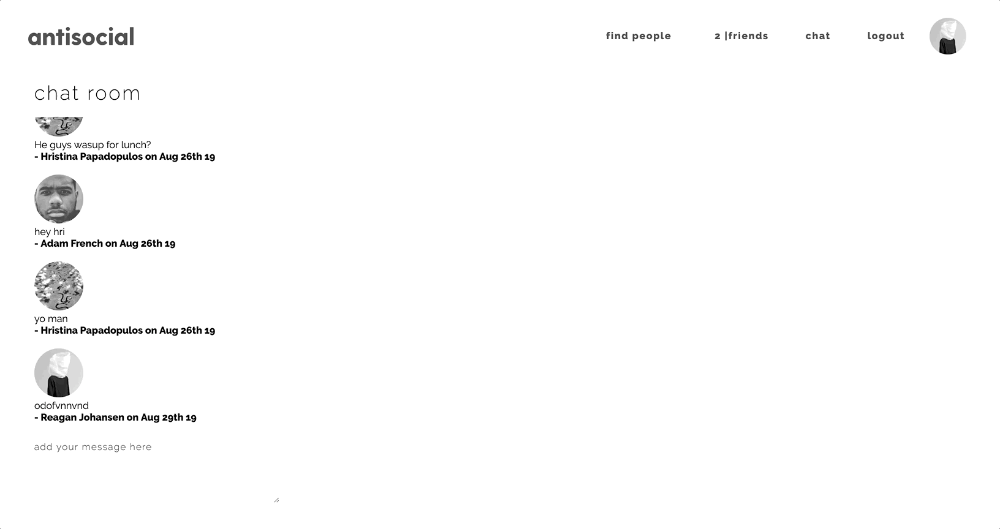

# Social Network Built with React.js

## Overview

Social network built with React.js using Hooks and Redux, Node.js, PostgreSQL, Socket.IO and AWS S3. Users can register, log in, update profile information including biography and profile picture, search, add and remove friends and chat with each other.

## Technology

 React.js | Redux | Node.js | Express.js | PostgreSQL | Socket.IO | AWS S3  

## Preview

#### Homepage and Login

#### Biography Editing

#### Profile Picture Upload

#### Search Users and Add Friends

#### Accepting Friends Requests and Socket.IO Notifications

#### Chat Room

